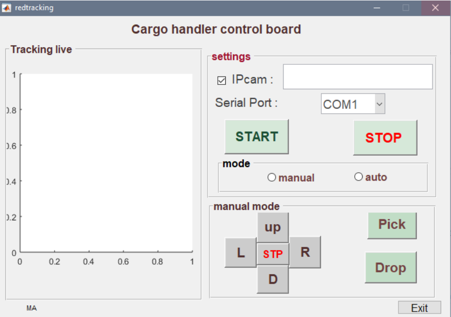
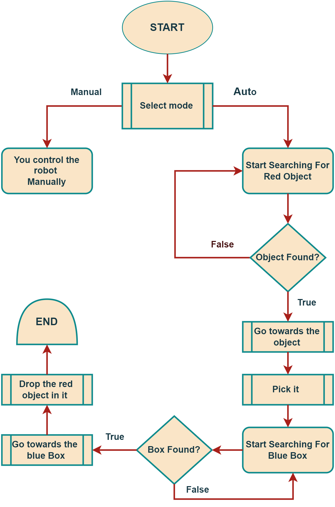
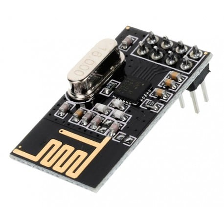
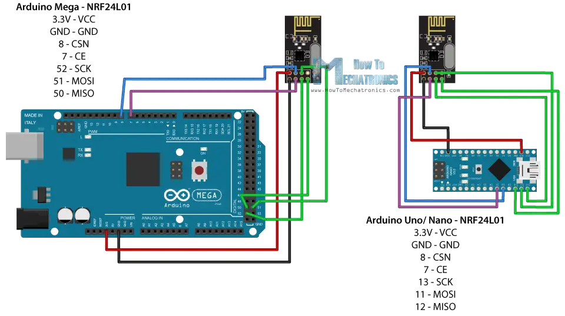
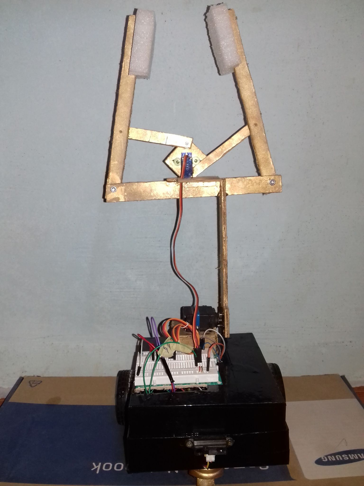
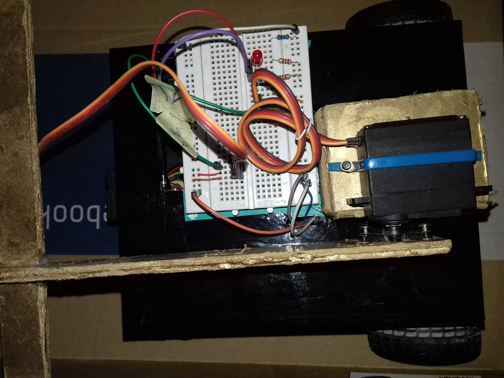

# Automatic Cargo Handling Robot  

 The aim of this project is to build a prototype of an automated cargo handling robot based on a color identification technique. A robotic device will automatically search for and find cargo based on a specific color, pick it up, and then search for another color to drop the object into as it searches for a target place.  

## Working principle

### 1. Overview of the  UI

    In the user interface the robot can be started/stopped and two options are given which enable the robot to run either manually or automatically, depending on the user's preference. Moreover, there is a section in the UI window where you can stream the robot view that is provided by the camera, which you can view in real time.  

* __Start the Robot:__

        __1rst:__ The  IP of the camera mounted on the robot must be entered;
        _Note: in this example a smartphone was used as the camera wit the aid of the IPcam android apps that let's you stream your phone camera to the network_

        __2nd:__  Ofter entering the correct camera IP, then the serial port of the transmitter system must be chosen; _Note: the serial port is the port that the Arduino board of the transmitter part is connected to_
    After that, Hit the start button and than select on of two modes:

* __manual control:__
    In this mode, you will be able to manually control the robot using the either the keyboard or using the _manual mode section_; you can navigate pick/drop objects while seeing the camera live stream.

* __automatic control:__
    In automatic mode, the robot will autonomously search for the a red abject, move toward it, pick it up, then will search for a blue box to drop the red object in it.

         _Note: the robot is equipped with sharpIR sensor to avoid pumping into the the target objects_

### 2. Working principle

the following flow chart explains the main operating flow of the robot Furthermore, in depth details of the operation are explained:

#### 2.1. Videos Streaming through the camera

    a camera is mounted to the robot and connected to a local wifi which can stream the video to the computer where teh image processing takes a place.

#### 2.2 Image processing Using MATLAB

    It is this part of the robot that is the most important. Using Matlab, the entire image processing process has been carried out. The task can be divided into several parts:
    An object is located after the video has been captured, the frame of the video is processed, the filtering and color detection are applied, and finally, the location of the object is determined, after that the data ar sent through serial transmission to the transmitter system.

#### 2.3 Data transmission through transmitter subsystem

    To send commands from MATLAB to the robot, we used an RF module (nRF24L01). This module is a pair, with one connected to the Arduino Uno that receives the serial data from MATLAB, and the other one connected to the Arduino MEGA 2560 in the robot. The serial data is transmitted between the two Arduino boards  over radio communication.

#### 2.4 the robot executes the received commands

    The robot executes the command for either from manual or atu mode.

## System components

The robot has three subsystems that are responsible od the whole operation:

### 1. Computer (Matlab)

    this part is the part responsible of image processing  of the video, extracting information and sending command to teh the transmitter subsystem. 

### 2. Transmitter subsystem

    In this subsystem  wireless data transmission was carried out, this system  has to main tasks: Receive data from the computer and send data to the robot through RF module. there are two component: 

* __Arduino board:__ Receive command form the computer:
 Arduino Uno connected to he PC to transmit the serial data from the Matlab to the Bot using RF module

* __RF (nRF24L01):__ Transmit the data to the robot.
nRF24L01, The RF module with a range about 30-200 m to transmit the
image processing serial data from computer to the Arduino board via
radio communication

* __RF module connection:__
A tutorial of how to connect the RF with arduino can be found in: [nRF24L01 – How It Works, Arduino Interface, Circuits, Codes](https://howtomechatronics.com/tutorials/arduino/arduino-wireless-communication-nrf24l01-tutorial/)

    _The code of the transmitter subsystem can be found in the folder named "Transmitter code"_

### 3. Robot subsystem

    The mobile robot has two  parts: the Robot cart and the robot arms as shown in the following figures: 

